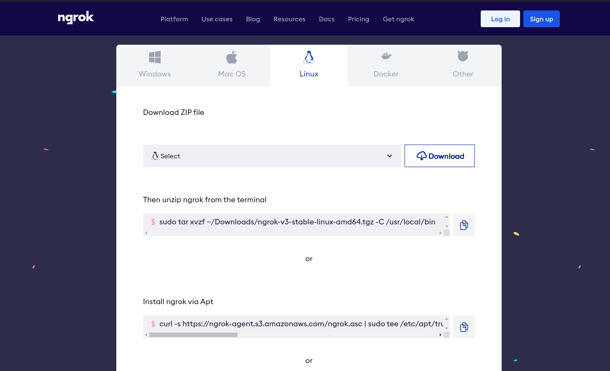
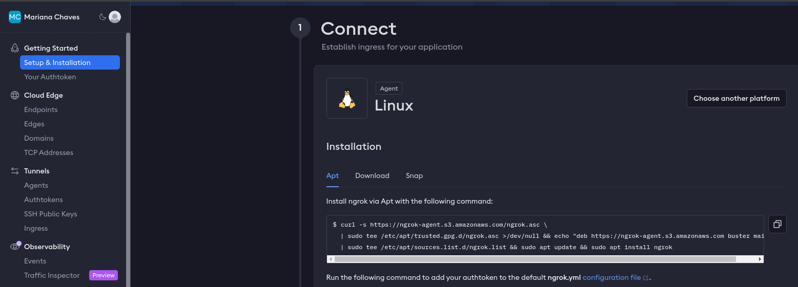
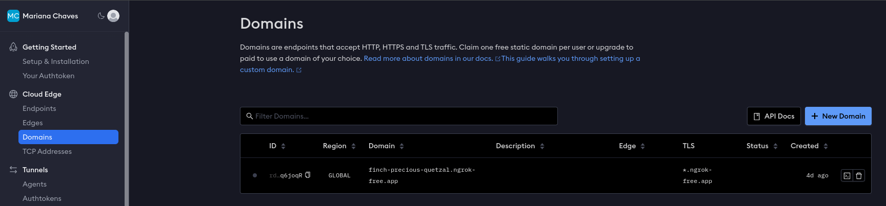
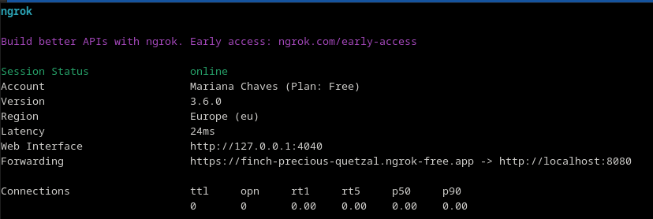
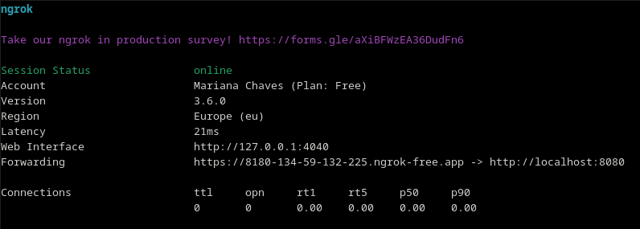
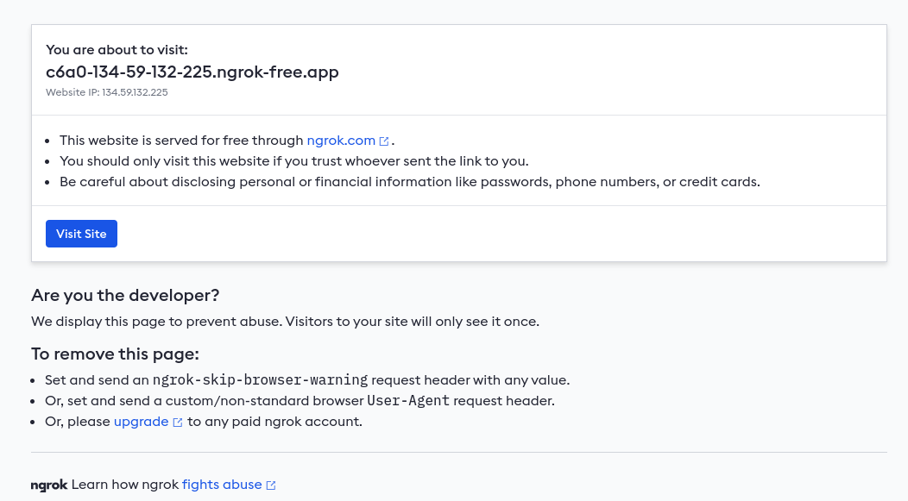
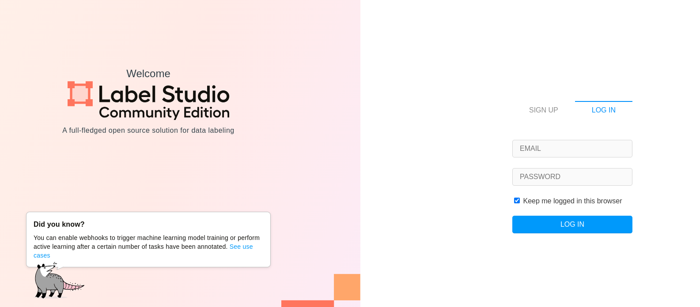

# Label Studio and ngrok integration

Author: Mariana Chaves

Last update: February 21st, 2024
- [Label Studio and ngrok integration](#label-studio-and-ngrok-integration)
  - [**Description**](#description)
  - [**Install ngrok**](#install-ngrok)
  - [**Authenticate in ngrok**](#authenticate-in-ngrok)
  - [**Get a static domain (optional)**](#get-a-static-domain-optional)
  - [**Start a tunnel**](#start-a-tunnel)
  - [**Invite users to access you project**](#invite-users-to-access-you-project)
  - [**What about next time?**](#what-about-next-time)
  - [**Advantages and disadvantages**](#advantages-and-disadvantages)
  - [**More info**](#more-info)


## **Description**

[Label Studio](https://labelstud.io/) is a powerful tool for data annotation, while [ngrok](https://ngrok.com/) allows you to securely expose local applications to the internet. Combining these two tools lets you share your Label Studio project with collaborators remotely, even if it's running on your local machine.

By using Label Studio and ngrok integration **you can simply share a link with your collaborator and they will have access to your Label Studio annotation tool**. There is no need for them to install Label Studio.

If you have not setup your Label-Studio project yet, take a look at [this document](setup.md) to get you started. In this documentation, we assume you already have a Label-Studio project ready to use.


## **Install ngrok**

Go to [https://ngrok.com/download](https://ngrok.com/download)

Choose the appropriate operating system for your machine and follow instructions on the website.



If you are using Linux and you are unsure about which ZIP file to choose, go to your terminal and use

```bash
uname -m
```

This will output the architecture of your processor.

Here are the ngrok ZIP files and their compatible architectures:

* `x86_64`: This is the most common architecture for laptops and desktops. Choose this file if your `uname -m` output is `x86_64` or `amd64`.
* `ARM64`: Choose this file if your `uname -m` output is `aarch64`.
* `386`: It's unlikely you have this architecture, but choose this file if your `uname -m` output is `i686`.

## **Authenticate in ngrok**

An authtoken in ngrok is a unique identifier that acts as your credential for authenticating and managing your account through the ngrok agent. It allows the agent to connect to the ngrok cloud and provides access to features like creating tunnels, managing teams, and viewing usage statistics. Here is how to use it:

Log in or sign up to your ngrok account ([https://ngrok.com/download](https://ngrok.com/download))

Go to your Ngrok dashboard. Access it [here](https://dashboard.ngrok.com/get-started/setup).



In the dashboard, you will find your authentication token.

In your terminal, run the following command to add your authtoken to the default ngrok.yml

```bash
ngrok config add-authtoken <Your token>
```

⚠️ **Security recommendation** ⚠️ : Store your authtoken securely in a password manager or environment variable. Treat it as sensitively as your password. Avoid embedding it directly in scripts or configurations.

## **Get a static domain (optional)**

If you don't have a static domain, the link to access your Label Studio project will change every time that you start a tunnel with ngrok.  If you want the link to stay the same, you can get a static domain.

Go to your Ngrok dashboard (Access it [here](https://dashboard.ngrok.com/get-started/setup)). \> Cloud Edge \> Domains \> New Domain



This will create a domain name composed of random words. In the previous example the domain is finch-precious-quetzal.ngrok-free.app

You can create only one static domain (using the free plan).

## **Start a tunnel**

Run ngrok with the port Label Studio runs on (usually `8080`). ngrok will create a secure tunnel.

**If you created an static domain**, run the following on the terminal, substitute the placeholder for your domain:

```bash
ngrok http --domain <your static domain> 8080
```

You should get something like this:


**If you did not create a static domain**, run the following on the terminal:

```bash
ngrok http --host-header=rewrite 8080
```

It will display the **Forwarding URL**. In the following example, it corresponds to  [https://8180-134-59-132-225.ngrok-free.app](https://8180-134-59-132-225.ngrok-free.app).



Either if you created or not a static domain, **keep the previous terminal window open**. If you close it, you close the tunnel.

Open another terminal.

Remember that Label Studio works as a python library. Therefore, it is recommended to use a `conda` or `pip` environment to use the tool instead of using the global environment. When you were setting up your Label Studio project you probably created an environment. Activate it:

Using conda:
```bash
conda activate <your environment name>
```

Using pip (go to the directory where you created the environment):

```bash
source <your environment name>/bin/activate
```

Start Label- Studio using the Forwarding URL

```bash
LABEL_STUDIO_HOST=<Forwarding URL or static domain> label-studio start
```

Keep this terminal open too.

## **Invite users to access you project**

Share the **Forwarding URL or static domain URL** with your collaborators.

Once they access it from their browser, they will see a message like this one:



They should click "Visit Site".

Next, they should be able to see the Label Studio login page:



They should log in or sign up to their Label Studio account. Notice that they DO NOT need to install label-studio on their machines, just create an account.

Done\!  🥳 Your collaborators can access your projects and annotate your dataset.

## **What about next time?**

The next time that you need to make your projects available to your collaborators just repeat the steps in sections [Start a Tunnel](#start-a-tunnel) and [Invite users to access you project](#invite-users-to-access-you-project)

## **Advantages and disadvantages**

**Advantages**

**Easy access for collaborators:** People accessing your Label Studio project just require the URL and a Label Studio account. They do not need to install Label Studio.

**Remote Annotation:** Allows collaborators to work on your project from anywhere with an internet connection.

**No Public Server Needed:** Avoids the need for setting up and maintaining a dedicated public server.

**Disadvantages:**

**Security:** Exposing your local network requires caution. Use trusted environments.

**Performance:** Performance might be impacted depending on your internet connection and network traffic.

**Dependent on your local machine:** Since the Label Studio project is running on your machine, you must keep your machine on and connected to the internet.

## **More info**

For more information visit: [https://labelstud.io/guide/start\#Expose-a-local-Label-Studio-instance-outside-using-ngrok](https://labelstud.io/guide/start#Expose-a-local-Label-Studio-instance-outside-using-ngrok)
