# **Label Studio: Annotating HS messages**

Author: Benjamin Ocampo

- [**Label Studio: Annotating HS messages**](#label-studio-annotating-hs-messages)
  - [**Description**](#description)
  - [**Quick Start**](#quick-start)
  - [**Usage**](#usage)
    - [**Launch Demo Video**](#launch-demo-video)
    - [**Creating a project**](#creating-a-project)
    - [**Exporting annotations**](#exporting-annotations)
  - [**Bugs**](#bugs)


## **Description**

Label studio is an open source data labeling tool for labeling and exploring multiple types of data. In particular, this documentation describes how to use a multi-layer annotation for sentences. We want to annotate the whole sentences without marking span words in the text.file

## **Quick Start**

Label studio works as a python library that can be installed with the `pip` package manager. Therefore, it is recommended to use a `conda` or `pip` environment to install the tool instead of using the global environment. We also recommend using  Miniconda if you haven’t installed it yet. The steps for this tool can be found on [this link](https://conda.io/projects/conda/en/latest/user-guide/install/index.html).

Once you decided to use `pip` or `conda` open a terminal, create an environment and activate it:

Using conda:

```bash
conda create \--name label-studio
conda activate label-studio
```

Using pip (note: It will be installed in the directory that you’re currently placed):

```bash
python \-m venv label-studio
source label-studio/bin/activate
```

The next step is to install the package through `pip`:

```bash
pip install label-studio
```

Label studio will inform you of any missing dependencies and it will install them.

## **Usage**

In order to launch Label Studio activate label-studio environment on the terminal

```bash
conda activate label\-studio
```

To open Label Studio use start command which opens a server on your local host that you can visualise on your browser window [localhost](localhost:8080/)

```bash
label\-studio start
```

Now you can create a new project in a browser window by adding a name of the project and its description, uploading a file to annotate and choosing a labeling setup

### **Launch Demo Video**

You can watch launch process [here](https://drive.google.com/file/d/1GxwV1Lo-m6eFaz0Ut1lCjgkTRjrvEmcS/view?usp=sharing)

### **Creating a project**

Create a new project by clicking on "Create". You will see a window like the following image. In this case we will work on the [GPGC](https://drive.google.com/file/d/13vVxiqmhFFcybcd-D3bdZHX1usiZlrek/view?usp=sharing) dataset as an example. So, as a convention, the name of the project will use the notation of the dataset.


*setup step 1*

Once you name the dataset, you just need to upload the corpus. It may be csv or json format.

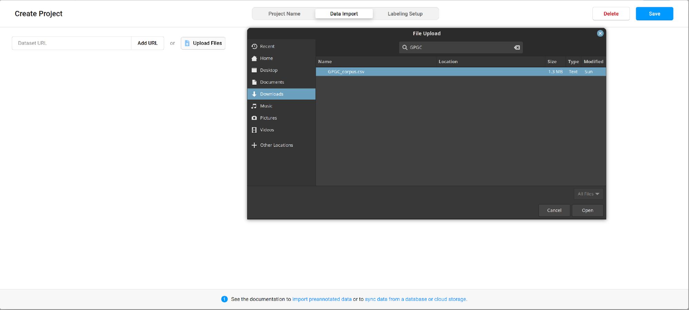
*setup step 2*

Then, click on the bullet point List of tasks.


*setup step 3*

Next step is to choose the type of the labeling task. In this case, Text Classification.

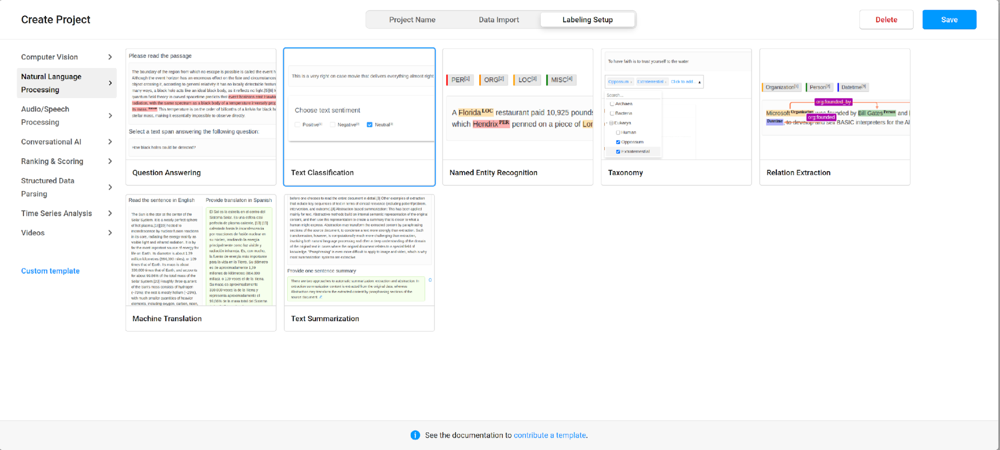
*setup step 4*

After that, we need to configure the name of the labels and layers that our instance annotation will have. Click on the button Code to configure the tool manually. You’ll see a code editor to settle the configuration.

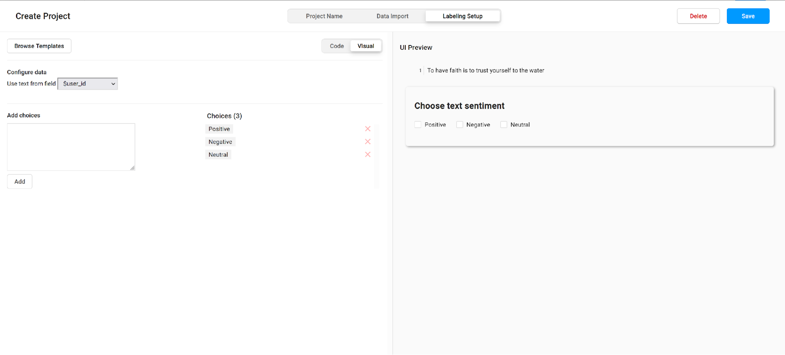

*setup step 5*

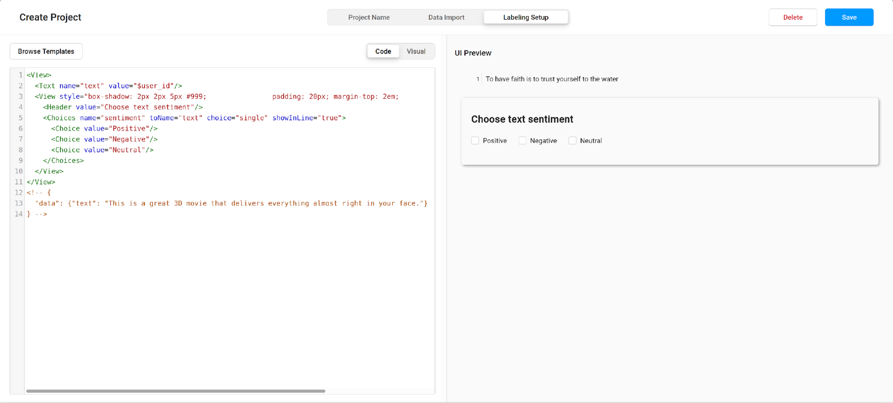

*setup step 6*

Copy and paste on the editor the following configuration.

```xml

<View>
 <!-- { Styles } -->
  <Style> .text {
    color: hsl(0 0% 20%);
    font-size: 2rem;
    line-height: 1.5;
    font-weight: 300;
    margin: 0;
  } </Style>

  <Style> .layer-box {
    box-shadow: 2px 2px 5px #999;
    padding: 10px;
    margin-top: 2em; border-radius: 5px;
  } </Style>

  <Style> .radio-toolbar input[type="radio"] {
    opacity: 0;
    position: fixed;
    width: 0;
  } </Style><View>
 <!-- { Styles } -->
  <Style> .text {
    color: hsl(0 0% 20%);
    font-size: 2rem;
    line-height: 1.5;
    font-weight: 300;
    margin: 0;
  } </Style>

  <Style> .layer-box {
    box-shadow: 2px 2px 5px #999;
    padding: 10px;
    margin-top: 2em; border-radius: 5px;
  } </Style>

  <Style> .radio-toolbar input[type="radio"] {
    opacity: 0;
    position: fixed;
    width: 0;
  } </Style>

  <Style> .grid-multiple-options {
    display: grid;
    grid-template-columns: auto auto auto auto auto;
    grid-template-rows: auto auto auto auto auto;
    column-gap: 10px;
    row-gap: 15px;
  } </Style>

  <Style> .radio-toolbar input[type="radio"] {
    opacity: 0;
    position: fixed;
    width: 0;
  } </Style>

  <Style> .radio-toolbar label {
    background-color: #ddd;
    padding: 10px 20px;
    font-family: sans-serif, Arial;
    font-size: 16px;
    border: 2px solid #444;
    border-radius: 4px;
  } </Style>

  <Style> .radio-toolbar input[type="radio"]:checked + label {
    background-color:#bfb;
    border-color: #4c4;
  } </Style>

  <Style> .radio-toolbar input[type="radio"]:focus + label {
    border: 2px dashed #444;
  } </Style>

  <!-- { Input: MESSAGE } -->
  <View className="text"><Text name="text" value="$tweet" granularity="sentence"/></View>

  <!-- { First Layer: IMPLICITNESS} -->
  <View className="layer-box radio-toolbar">
    <Header value="Implicitness"/>
    <Choices name="implicit_layer" toName="text" choice="single" showInLine="true" required="true">
      <Choice value="Implicit HS"/>
      <Choice value="Explicit HS"/>
      <Choice value="Undecided"/>
    </Choices>
  </View>

  <!-- { Second Layer: SUBTLETY} -->
  <View className="layer-box radio-toolbar" whenChoiceValue="Implicit HS,Explicit HS" whenTagName="implicit_layer" visibleWhen="choice-selected">
    <Header value="Subtlety"/>
    <Choices name="subtlety_layer" toName="text" choice="single" showInLine="true">
      <Choice value="Subtle"/>
      <Choice value="Non-Subtle"/>
      <Choice value="Undecided"/>
    </Choices>
  </View>

  <!-- { Third Layer: PROPERTIES} -->
  <View className="layer-box radio-toolbar" whenChoiceValue="Implicit HS" whenTagName="implicit_layer" visibleWhen="choice-selected">
    <Header value="Implicit Properties"/>
    <Choices name="implicit_properties_layer" toName="text" choice="multiple" showInline="true">
      <View className="grid-multiple-options">
      <Choice value="Antithesis"/>
      <Choice value="Black humor"/>
      <Choice value="Circumlocution"/>
      <Choice value="Context"/>
      <Choice value="Euphemism"/>
      <Choice value="Exaggeration"/>
      <Choice value="Extralinguistic knowledge"/>
      <Choice value="Fallacy"/>
      <Choice value="Humiliation"/>
      <Choice value="Inference"/>
      <Choice value="Irony"/>
      <Choice value="Metaphor"/>
      <Choice value="Metonymy"/>
      <Choice value="Rhetorical question"/>
      <Choice value="Sarcasm"/>
      <Choice value="Sentiment"/>
      <Choice value="Synecdoche"/>
<Choice value="Visual signs"/>
      </View>
    </Choices>
  </View>
</View>

  <Style> .grid-multiple-options {
    display: grid;
    grid-template-columns: auto auto auto auto auto;
    grid-template-rows: auto auto auto auto auto;
    column-gap: 10px;
    row-gap: 15px;
  } </Style>

  <Style> .radio-toolbar input[type="radio"] {
    opacity: 0;
    position: fixed;
    width: 0;
  } </Style>

  <Style> .radio-toolbar label {
    background-color: #ddd;
    padding: 10px 20px;
    font-family: sans-serif, Arial;
    font-size: 16px;
    border: 2px solid #444;
    border-radius: 4px;
  } </Style>

  <Style> .radio-toolbar input[type="radio"]:checked + label {
    background-color:#bfb;
    border-color: #4c4;
  } </Style>

  <Style> .radio-toolbar input[type="radio"]:focus + label {
    border: 2px dashed #444;
  } </Style>

  <!-- { Input: MESSAGE } -->
  <View className="text"><Text name="text" value="$tweet" granularity="sentence"/></View>

  <!-- { First Layer: IMPLICITNESS} -->
  <View className="layer-box radio-toolbar">
    <Header value="Implicitness"/>
    <Choices name="implicit_layer" toName="text" choice="single" showInLine="true" required="true">
      <Choice value="Implicit HS"/>
      <Choice value="Explicit HS"/>
      <Choice value="Undecided"/>
    </Choices>
  </View>

  <!-- { Second Layer: SUBTLETY} -->
  <View className="layer-box radio-toolbar" whenChoiceValue="Implicit HS,Explicit HS" whenTagName="implicit_layer" visibleWhen="choice-selected">
    <Header value="Subtlety"/>
    <Choices name="subtlety_layer" toName="text" choice="single" showInLine="true">
      <Choice value="Subtle"/>
      <Choice value="Non-Subtle"/>
      <Choice value="Undecided"/>
    </Choices>
  </View>

  <!-- { Third Layer: PROPERTIES} -->
  <View className="layer-box radio-toolbar" whenChoiceValue="Implicit HS" whenTagName="implicit_layer" visibleWhen="choice-selected">
    <Header value="Implicit Properties"/>
    <Choices name="implicit_properties_layer" toName="text" choice="multiple" showInline="true">
      <View className="grid-multiple-options">
      <Choice value="Antithesis"/>
      <Choice value="Black humor"/>
      <Choice value="Circumlocution"/>
      <Choice value="Context"/>
      <Choice value="Euphemism"/>
      <Choice value="Exaggeration"/>
      <Choice value="Extralinguistic knowledge"/>
      <Choice value="Fallacy"/>
      <Choice value="Humiliation"/>
      <Choice value="Inference"/>
      <Choice value="Irony"/>
      <Choice value="Metaphor"/>
      <Choice value="Metonymy"/>
      <Choice value="Rhetorical question"/>
      <Choice value="Sarcasm"/>
      <Choice value="Sentiment"/>
      <Choice value="Synecdoche"/>
<Choice value="Visual signs"/>
      </View>
    </Choices>
  </View>
</View>


```

Once you pasted the configuration you will see the UI Preview panel like this. If that’s the case, click on Save.

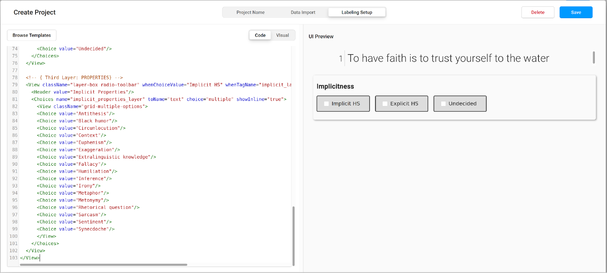

*setup step 7*

You’ll see the following panel. You’ll see the same information you had in your dataset. In this case the GPGC corpus. There are also 6 other columns that will help you to track your job in the annotation process.

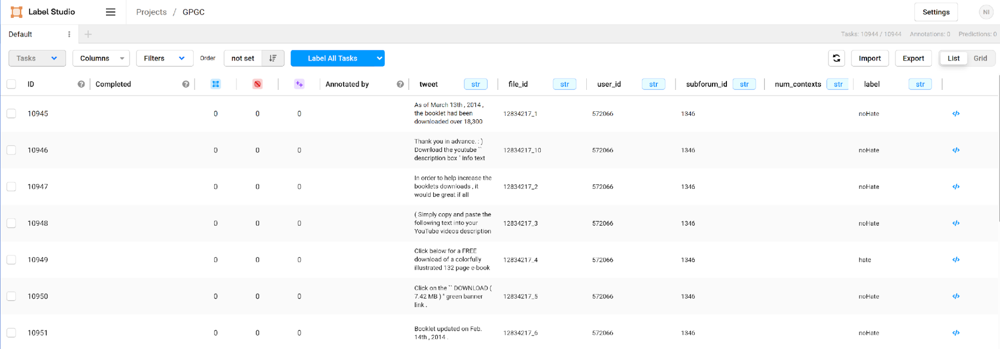

*setup step 8*

There is no need to go through the whole dataset if you need to tackle a specified part of it. Label Studio allows you to filter the necessary part by any label or column.

We recommend to filter the unnecessary columns, leaving just the one with the messages, the available labels of GPGC, and the ones provided by label studio. Since we are going to annotate only existing labels, we also suggest filtering those examples that are only hate.

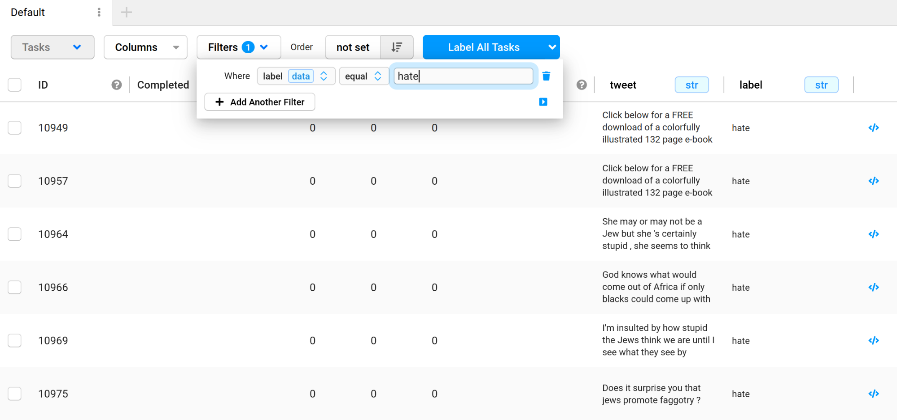

*setup step 9*

After filtering choose the option Label Tasks As Displayed instead of Label All Tasks. In that way, you’ll annotate only those messages that remained after the previous filter.

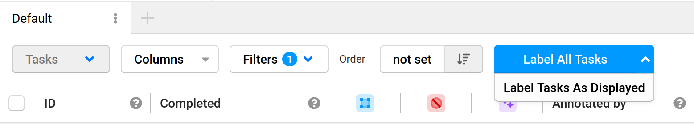

*setup step 10*

That’s it\! You can start annotating. Once you’re done with your decision. Just click on the submit button or press CTRL \+ ENTER to move to the next message.

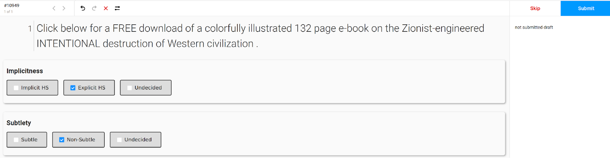

*setup step 11*

Enjoy it\!

### **Exporting annotations**

After you finish the annotation process you can export the annotated dataset in json and csv formats. Both file types make it possible to parse the annotation labels as they are stored in lists and dictionaries.

You just need to go to the main panel of your project and click on Export.

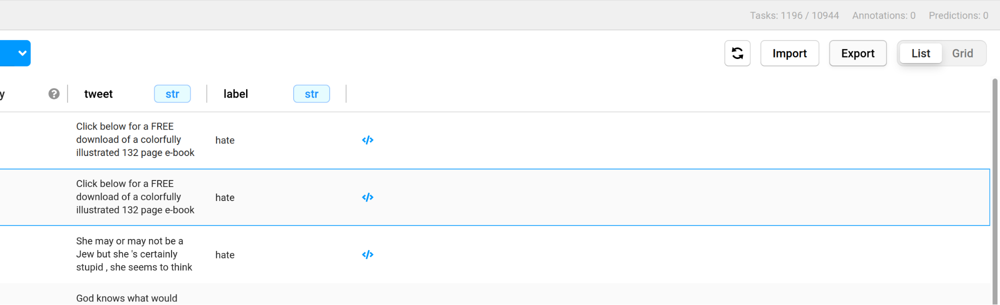

*setup step 12*

After that, choose the right format according to your needs and save it in your local file system\!

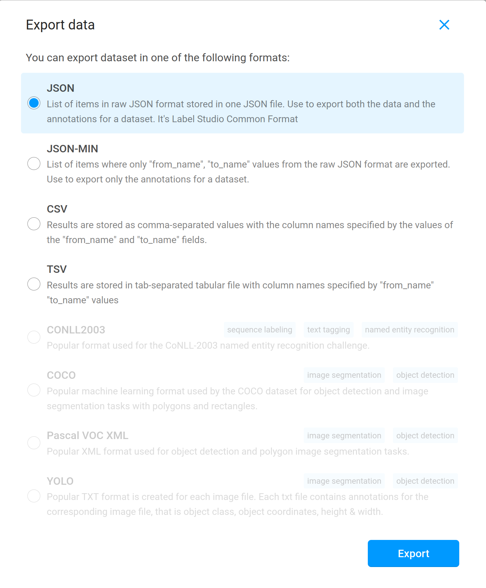

*setup step 13*

You’re ready to go\!

## **Bugs**

*Update Button*

In case you annotated a message in the wrong way, it’s easy to get back with a back arrow and make annotation changes. To save the result, you press the button *Update* which updates the annotation, but doesn’t switch to the next message, so you have to use a forward arrow.

*Annotation changes*

If you make changes in some layers of the multi-layered annotation scheme, make sure to remove the unnecessary ticks manually. Even if a tool makes it automatically according to your annotation scheme, you risk to export the annotated file with all choices you had as they are saved in the tool memory.
